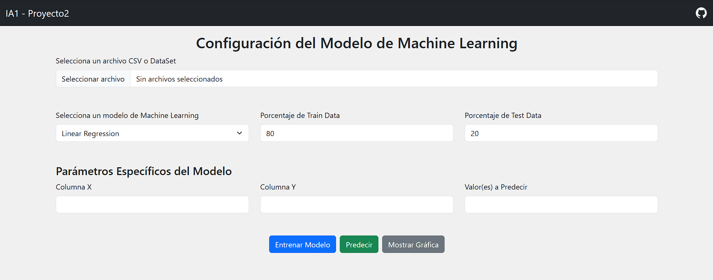
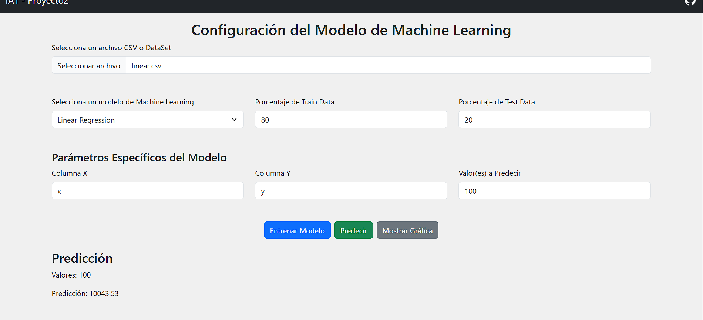
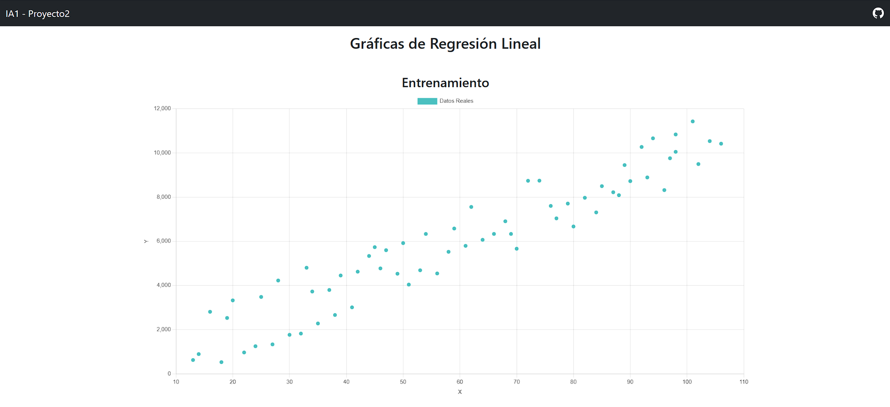

*Universidad de San Carlos de Guatemala*  
*Escuela de Ingeniería en Ciencias y Sistemas, Facultad de Ingenieria*  
*Inteligencia Artificial 1, 2do. Semestre 2024.*  

___
# **PROYECTO 2**
## **Machine Learning**
___
## **201944994 - Robin Omar Buezo Díaz**  

### **Resumen**
Esta aplicación está desarrollado por requerimientos de la Facultad de Ingeniería de la Universidad de San Carlos de Guatemala.

Estos requerimientos cosisten en el desarrollo de una aplicación web desde la cual se pueden entrenar diferentes modelos de Machine Learning, visualizar las gráficas correspondientes al entrenamiento y realizar predicciones de datos por medio del modelo.
___
### **Introducción**  
El presente documento tiene como finalidad mostrar al usuario la funcionalidad y desarrollo del software para que entienda su construcción y pueda dar solución a cualquier error que pueda presentarse.  

Se explican el flujo y las diferentes partes que lo constituyen y cómo debemos de interactuar con este para que nos sea de gran ayuda y podamos sacarle el máximo provecho a nuestra herramienta.
___
___
## **Manual Técnico**

### **Paradigma de Programación**
El paradigma de programación utilizado para el desarrollo de esta aplicación es el paradigma modular. Este enfoque permite organizar el código en archivos separados, cada uno responsable de funciones específicas relacionadas con diferentes modelos de aprendizaje automático. Al utilizar módulos, se mejora la mantenibilidad y escalabilidad del código, facilitando la reutilización de funciones y promoviendo un desarrollo más limpio y estructurado.

### **Nomenclatura**  

- **Variables**: Camel Case
  - Ejemplo: `currentModel`, `trainPercent`

- **Funciones**: Pascal Case
  - Ejemplo: `updateParams()`, `execLinearRegression()`

- **Eventos**: Snake Case
  - Ejemplo: `document.onload`, `btn_train.addEventListener` 

- **Etiquetas HTML**: Kebab Case
  - Ejemplo: `<nav class="navbar">`, `
`, `<form id="mlForm">`

- **Clases CSS**: Kebab Case
  - Ejemplo: `class="form-label"`, `class="text-center"`, `class="btn btn-primary"`

- **IDs**: Kebab Case
  - Ejemplo: `id="dataFile"`, `id="btnTrain"`, `id="results"`

- **Atributos de datos**: Kebab Case
  - Ejemplo: `data-bs-toggle="collapse"`, `data-bs-target="#navbarNav"`

- **Atributos de JavaScript**: Kebab Case (en el caso de eventos)
  - Ejemplo: `onclick="myFunction()"`, `onload="init()"` 

---

### **Archivos Relevantes**  
### linear.js

Este archivo contiene funciones para ejecutar la regresión lineal.

- **execLinearRegression()**: 
  - Se encarga de cargar los datos desde un archivo CSV y dividirlos en conjuntos de entrenamiento y prueba según los porcentajes ingresados.
  - Verifica la existencia de las columnas seleccionadas y entrena un modelo de regresión lineal utilizando los datos de entrenamiento.
  - Genera gráficos para visualizar los datos reales y las predicciones, así como el error cuadrático medio (MSE).
  - Almacena los datos del gráfico en `localStorage` y muestra un mensaje de confirmación.

- **predictLinearRegression()**: 
  - Toma valores ingresados por el usuario para realizar predicciones utilizando el modelo de regresión lineal entrenado.
  - Valida los valores ingresados, realiza la predicción y muestra los resultados en el DOM.

---

### polynomial.js

Este archivo implementa funciones para la regresión polinómica.

- **execPolynomialRegression()**: 
  - Similar a `execLinearRegression`, pero permite al usuario especificar el grado del polinomio.
  - Carga los datos, verifica las columnas y el grado, y entrena un modelo de regresión polinómica.
  - Genera gráficos y almacena datos en `localStorage`, mostrando un mensaje al finalizar el entrenamiento.

- **predictPolynomialRegression()**: 
  - Realiza predicciones con el modelo de regresión polinómica utilizando los valores ingresados por el usuario.
  - Valida los datos, efectúa la predicción y muestra los resultados en el DOM.

---

### tree.js

Este archivo contiene funciones para implementar un árbol de decisión.

- **execDecisionTree()**: 
  - Carga datos desde un archivo CSV y los divide en conjuntos de entrenamiento y prueba.
  - Crea una representación del árbol de decisión utilizando el algoritmo ID3 y genera un gráfico en formato DOT.
  - Almacena los datos en `localStorage` y muestra un mensaje de éxito.

- **predictDecisionTree()**: 
  - Permite realizar predicciones utilizando el modelo de árbol de decisión.
  - Toma valores ingresados por el usuario, genera una tabla con las predicciones y la muestra en el DOM.

---

### bayes.js

Este archivo implementa un clasificador Naive Bayes.

- **execBayes()**: 
  - Carga datos desde un archivo CSV, organiza los valores por columnas y entrena un modelo Naive Bayes.
  - Genera un select con las columnas para predecir y construye selectores dinámicamente para cada variable.
  - Almacena la información en `localStorage` y muestra un mensaje de confirmación al finalizar.

- **predictBayes()**: 
  - Realiza predicciones utilizando el modelo entrenado y los valores ingresados por el usuario.
  - Muestra el resultado de la predicción en el DOM.

---

### neuronal.js

Este archivo contiene funciones para implementar una red neuronal simple.

- **execNeuronalNetwork()**: 
  - Carga datos desde un archivo CSV y selecciona las columnas específicas para entrenar la red neuronal.
  - Verifica la existencia de las columnas seleccionadas en los datos.
  - Crea un modelo de red neuronal con una arquitectura predefinida y entrena el modelo utilizando los datos de entrada, etiquetando las salidas basadas en una comparación.
  - Realiza una predicción con un conjunto de valores específicos y almacena los resultados en `localStorage`.
  - Muestra un mensaje de confirmación una vez que la red neuronal ha sido entrenada.

- **predictNeuronalNetwork()**: 
  - Permite al usuario ingresar valores para realizar predicciones con el modelo de red neuronal.
  - Valida los valores ingresados, realiza la predicción, y muestra los resultados en el DOM.

---

### kmeans.js

Este archivo implementa el algoritmo K-Means para la agrupación de datos.

- **execKMeans()**: 
  - Carga datos desde un archivo CSV y permite al usuario seleccionar una columna para la agrupación.
  - Verifica que la columna seleccionada exista y obtiene los datos correspondientes.
  - Solicita al usuario el número de clusters (`k`) y el número de iteraciones para el algoritmo.
  - Utiliza la clase `LinearKMeans` para agrupar los datos en clusters y genera un gráfico de dispersión utilizando Google Charts para visualizar los resultados.
  - Muestra los puntos agrupados y los clusters en un gráfico interactivo.

---

### knn.js

Este archivo implementa el algoritmo K-Nearest Neighbors (KNN).

- **execKnn()**: 
  - Carga datos desde un archivo CSV y organiza los datos en un formato adecuado para el entrenamiento del modelo KNN.
  - Crea un objeto de la clase `KNearestNeighbor` utilizando los datos de entrenamiento y almacena la información relevante en `localStorage`.
  - Muestra un mensaje de confirmación una vez que el modelo ha sido entrenado.

- **predictKnn()**: 
  - Permite al usuario ingresar un valor para realizar predicciones utilizando el modelo KNN.
  - Calcula las distancias euclidiana y manhattan entre el valor ingresado y los datos de entrenamiento, mostrando

---

### index.js

Este archivo gestiona la interacción entre la interfaz de usuario y los modelos de machine learning, permitiendo al usuario seleccionar, entrenar y predecir utilizando diferentes algoritmos.

#### Variables Globales

- `currentModel`: Almacena el modelo de machine learning actualmente seleccionado y entrenado.
- `currentRoot`: Utilizada para guardar la raíz del árbol en caso de que se seleccione un modelo de árbol de decisión.

#### Eventos y Funciones

- **Cargar Parámetros Iniciales**:
  - Al cargar el documento, se actualizan los parámetros de la interfaz a través de `updateParams()`.

- **updateParams()**:
  - Resetea los modelos actuales y limpia los resultados.
  - Muestra u oculta secciones de parámetros según el modelo seleccionado en el menú desplegable.
  - Desactiva ciertos controles si se seleccionan modelos específicos (como `bayes`, `neuronal`, `kmeans`, o `knn`).

- **Entrenamiento del Modelo**:
  - Se agrega un evento al botón de entrenamiento (`btnTrain`). Según el modelo seleccionado, se llama a la función de entrenamiento correspondiente (por ejemplo, `execLinearRegression`, `execNeuronalNetwork`, etc.).
  
- **Predicción**:
  - Se agrega un evento al botón de predicción (`btnPredict`). Si no se ha entrenado un modelo, se muestra una alerta. Si se ha entrenado, se llama a la función de predicción adecuada según el modelo seleccionado.

- **Gráficos**:
  - Se agrega un evento al botón de graficar (`btnGraph`). Si no hay datos en `localStorage`, se muestra una alerta; de lo contrario, se abre una nueva ventana con el gráfico.

- **parseCSV()**:
  - Función que maneja la lectura de archivos CSV. Utiliza `FileReader` para leer el archivo seleccionado y `PapaParse` para parsear los datos en formato JSON. Resuelve o rechaza una promesa según el éxito de la operación de lectura.

#### Interacción con la Interfaz de Usuario

La interfaz permite al usuario seleccionar modelos de machine learning, entrenarlos con datos de un archivo CSV, y realizar predicciones o visualizar gráficos de resultados, proporcionando una experiencia interactiva y fácil de usar.

---

### graph.js

Este archivo es responsable de renderizar gráficos y tablas basados en los datos almacenados en `localStorage`. Utiliza la biblioteca Chart.js para crear gráficos y la biblioteca Vis.js para visualizar estructuras de árbol.

#### Carga de Datos

- **Carga de `graphData`**:
  - Se obtienen los datos de gráficos desde `localStorage` y se parsean como un objeto JSON.
  - Se verifica si hay datos de gráficos disponibles (`graphData` y `graphData.graphs`).

#### Renderizado de Gráficos

1. **Contenedor de Gráficos**:
   - Se selecciona el contenedor donde se colocarán los gráficos (`chartsContainer`).

2. **Iteración a través de los Gráficos**:
   - Se recorre cada gráfico en `graphData.graphs` para crear la visualización adecuada.

3. **Título del Gráfico**:
   - Se establece el título del gráfico según el modelo (lineal, polinómico, etc.).

4. **Creación del Gráfico**:
   - Si hay conjuntos de datos en el gráfico, se crea un contenedor para el gráfico y se inicializa un gráfico usando Chart.js.
   - Se configuran las propiedades del gráfico, como el tipo (línea, dispersión) y los datos a graficar.

5. **Tablas de Datos**:
   - Si hay una tabla asociada al gráfico, se crea una tabla HTML que muestra los datos subyacentes, con un encabezado y filas de datos.

6. **Visualización de Árboles**:
   - Si el tipo de gráfico es un árbol (`tree`), se crea un contenedor específico y se utiliza Vis.js para renderizar el árbol a partir de un formato DOT.

#### Renderización de Tabla General

- Si hay una tabla general en `graphData`, se crea y se muestra de manera similar a las tablas individuales de los gráficos.

#### Manejo de Errores

- Si no hay datos disponibles para graficar, se muestra una alerta al usuario.

#### Interacción con el Usuario

Este archivo permite a los usuarios visualizar de manera efectiva los resultados de los modelos de machine learning en forma de gráficos y tablas, facilitando la interpretación de los resultados obtenidos.

### **Recursos**  
### PapaParse

Esta biblioteca permite analizar y convertir archivos CSV en objetos de JavaScript. Es conocida por su rendimiento rápido y su capacidad para manejar grandes volúmenes de datos, así como por su soporte para encabezados y manejo de errores.

### Tytus

Biblioteca que ofrece diferentes modelos de Machine Learning para poder implementarlos con su respectivo entrenamiento, generación de gráficas y posterior uso.

### gstatic/charts/loader

La biblioteca `gstatic/charts/loader` es parte de Google Charts y se utiliza para cargar la biblioteca de gráficos de Google. Proporciona una amplia gama de tipos de gráficos interactivos que pueden mejorarse con personalización y opciones de interactividad.

### Chart.js

Chart.js es una biblioteca para crear gráficos animados y responsivos de manera sencilla. Ofrece una API fácil de usar, varios tipos de gráficos y opciones de personalización, así como animaciones suaves para mejorar la presentación visual.

### Vis.js

Vis.js es una biblioteca de visualización de datos que permite crear gráficos de redes, líneas de tiempo y más. Es especialmente útil para representar relaciones y conexiones entre datos, ofreciendo interactividad y opciones de personalización.

### Bootstrap

Bootstrap es un marco de diseño front-end que ayuda a crear aplicaciones web responsivas. Proporciona un sistema de cuadrícula, componentes predefinidos y opciones de personalización mediante CSS y JavaScript, facilitando el desarrollo de interfaces atractivas y funcionales.
___
___

## **Manual de Usuario**

### **Pantallas Principales**
#### ***Index***
  
Esta es la pantalla principal de la aplicación, desde acá se pueden realizar las siguientes acciones:

- **Cargar de DataSet:**
    El usuario cuenta con un campo de entrada en el que puede cargar su DataSet en formato CSV que se utilizará tanto para entrenamiento o para pruebas.

- **Selección de Modelo de Machine Learning:**
    El usuario cuenta con un select donde puede elegir el modelo de Machine Learning que se utilizará, de igual forma cuenta con dos campos donde se especifíca el porcentaje de datos para entrenamiento y para test del DataSet.

- **Parámetros Específicos del Modelo:**
    En esta parte el usuario podrá ingresar los parámetros necesarios para configurar el modelo elegido. Esta sección se actuliza de manera dinámica dependiendo del modelo escogido.

- **Área de botones:**
    Por ultimo el usuario podrá ver los botones que le permitirán realizar las distintas acciones con las que cuenta la aplicación, como por ejemplo, realizar el entrenamiento del modelo, realizar una predicción o generar las gráficas del modelo.

- **Área de Resultados:**
    Por último, el usuario contará con una sección de resultados que se mostrará a la hora de realizar alguna predicción del respectivo modelo.
     

#### ***Gráficas del Modelo***
  
Esta es la pantalla donde el usuario podrá visualizar las gráficas que se generen en el entranamiento del modelo. Estas serán diferentes dependiendo del modelo que se esté entrenando.